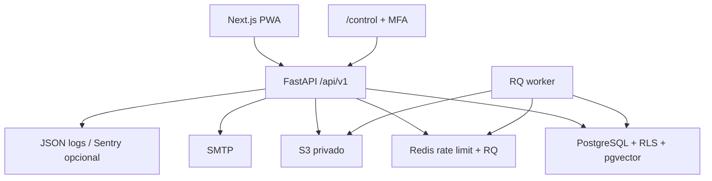

# Arquitectura de ForgeOps

> Estado: Production Deployment Foundation V1.2.3. Las decisiones completas estan en `docs/adr/`.

ForgeOps es un monorepo con frontend Next.js, API FastAPI, worker RQ, PostgreSQL/pgvector, Redis y almacenamiento S3 compatible. Frontend, backend y worker son contenedores independientes y stateless. PostgreSQL, Redis y S3 son los unicos almacenes persistentes.



El dominio se divide en empresas, usuarios, plantas, activos, incidencias, ordenes, preventivos, inventario, documentos/RAG, onboarding, auditoria, jobs y operadores. Cada modulo conserva rutas, esquemas, servicio y modelos propios.

La API usa `/api/v1`; cambios incompatibles se publicaran en una version nueva. La capa de entitlements resuelve plan, modulos, flags y limites sin dispersar condicionales comerciales. La capa de storage evita acoplamiento con Railway. Los contratos de integraciones industriales permanecen separados y no se ejecutan dentro de requests HTTP.

Para detalles consultar [multi-tenancy-security.md](multi-tenancy-security.md), [storage.md](storage.md), [pwa.md](pwa.md) y [railway-production.md](railway-production.md).

ForgeOps V1.2 es un monolito modular multiempresa con dos aplicaciones desplegables, almacenamiento documental privado y PostgreSQL con `pgvector`.

```text
Browser -> Next.js -> FastAPI -> PostgreSQL + pgvector
                       |   |
                       |   +-> volumen privado de documentos
                       |
                       +-> OpenAI opcional
```

## Modulos

```text
auth        identidad, tokens y sesiones
companies   configuracion empresarial
plants      centros productivos
users       equipo y permisos
audit       trazabilidad administrativa
assets      maestro de equipos
incidents   averias y seguimiento
work_orders ejecucion del mantenimiento
maintenance planificacion preventiva
inventory   repuestos y movimientos
documents   archivos privados
ai          ingesta, recuperacion y RAG
dashboard   KPIs y onboarding
onboarding  progreso individual y tutorial guiado
operators   identidad propietaria y gobierno de plataforma
```

## Decisiones

- UUID para identificadores publicos.
- `company_id` obligatorio en toda entidad empresarial.
- Consultas acotadas desde el usuario autenticado, nunca desde datos enviados por el navegador.
- Selector de planta como filtro opcional dentro de la empresa autorizada.
- Access token corto y refresh token rotatorio almacenado como hash.
- Permisos centralizados por rol y reglas adicionales en el dominio.
- Alembic como unica via de evolucion del esquema.
- Semilla idempotente apoyada en restricciones unicas.
- Archivos fuera del directorio publico y descargas autenticadas.
- Auditoria separada de los datos operativos y conservacion del actor cuando existe.
- Suscripcion y modulos resueltos en el contexto de empresa, nunca desde el navegador.
- Caducidad de pruebas evaluada en cada acceso y escritura bloqueada con HTTP 402.
- Nucleo operativo siempre activo; modulos opcionales protegidos tanto en API como en UI.
- Identidad de operador separada de usuarios tenant, con tokens, sesiones, cookie y auditoria propios.
- MFA TOTP obligatorio para `/control`, codigos no reutilizables y bloqueo temporal por intentos.
- Movimientos de inventario inmutables; las devoluciones compensan un consumo original sin reescribirlo.
- Version optimista y bloqueo de fila para impedir descuentos concurrentes o stock negativo.
- Coste unitario congelado en cada movimiento y coste neto firmado agregado por orden.

## Modulos comerciales

`assets`, `incidents` y `work_orders` forman el nucleo trazable. `maintenance`, `inventory`, `documents` y `ai` se habilitan por empresa mediante `enabled_modules`. El asistente documental depende de Documentacion, y la API aplica esta dependencia aunque una ruta se invoque directamente.

El registro de prueba crea empresa, administrador y planta dentro de una unica transaccion. Los datos de ejemplo son propios de ese tenant; no se comparte una base demostrativa entre evaluadores.

## Limites de dominio

Los servicios validan relaciones cruzadas antes de escribir: una orden no puede apuntar a un activo de otra planta, un responsable debe pertenecer a la empresa y un documento solo se recupera dentro de su tenant. Desactivar usuarios revoca sesiones; eliminar el ultimo administrador o desactivar una planta con activos se rechaza.

## Plano de control

`PlatformOperator` no tiene `company_id` y no reutiliza el rol `SUPER_ADMIN`. Su token declara el actor `operator`; las dependencias tenant rechazan esos tokens y las dependencias del backoffice rechazan tokens de clientes. El plano de control ofrece agregados comerciales y operativos, pero no rutas para leer incidencias, documentos o conocimiento de una empresa. Suspensiones, ampliaciones y cambios de modulos conservan operador, IP, motivo y estado anterior en `operator_audit_events`.

## Inteligencia documental

La ingesta extrae TXT, PDF y DOCX, normaliza el texto y crea fragmentos solapados. Cada fragmento conserva empresa, documento, activo y pagina. La reindexacion reemplaza los fragmentos anteriores y la restriccion `(document_id, chunk_index)` evita duplicados.

El modo local utiliza recuperacion lexica y respuestas extractivas. El modo OpenAI calcula embeddings, consulta `pgvector` por distancia coseno y genera con evidencia limitada. Los umbrales absolutos y relativos evitan presentar los fragmentos menos malos como si fueran relevantes.

## Despliegue

Los tres servicios se ejecutan con Docker Compose y healthchecks. El backend migra y prepara datos al iniciar. Para un piloto, PostgreSQL y los volumentes deben respaldarse, los servicios deben quedar detras de TLS y solo el proxy debe estar expuesto. Consulta [pilot-deployment.md](pilot-deployment.md).
