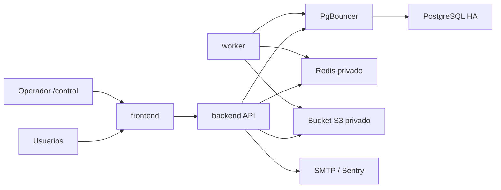

# Railway para ForgeOps

Esta guia prepara el repositorio para Railway. El despliegue real requiere una cuenta Railway, dominios, proveedor SMTP y secretos que no forman parte de Git.



## Proyecto y entornos

Crear el proyecto `FORGEOPS` con entornos Railway `staging` y `production`. Cada entorno contiene instancias independientes:

| Servicio | Staging | Produccion |
| --- | --- | --- |
| `frontend` | 1 replica | 2 replicas iniciales |
| `backend` | 1 replica | 2 replicas iniciales |
| `worker` | 1 replica | 1 o mas por profundidad de cola |
| `Redis` | instancia privada | instancia privada persistente |
| `PgBouncer` | pool privado | pool privado |
| PostgreSQL | nodo independiente | PostgreSQL HA |
| `Bucket` | bucket privado | bucket privado con retencion propia |

## Servicios desde el repositorio

Conectar `frontend`, `backend` y `worker` al repositorio GitHub. Mantener la raiz del monorepo y asignar:

| Servicio | Config as Code |
| --- | --- |
| backend | `/deploy/railway/backend.toml` |
| worker | `/deploy/railway/worker.toml` |
| frontend | `/deploy/railway/frontend.toml` |

El backend ejecuta `alembic upgrade head` como pre-deploy y luego comprueba que el esquema coincide con Alembic. Los healthchecks controlan el cambio de trafico. Configurar 30 segundos de draining como minimo para recibir `SIGTERM` antes de `SIGKILL`.

## Red y dominios

- `app.forgeops.es` apunta a `frontend`.
- `control.forgeops.es` apunta al mismo `frontend`; Next.js mantiene identidad y rutas separadas.
- `api.forgeops.es` apunta a `backend`.
- Redis, PostgreSQL, PgBouncer y worker no tienen dominio publico.
- Backend y worker usan DNS privado y variables de referencia Railway.

El navegador necesita el dominio publico de API. Los servicios internos deben usar `*.railway.internal` o referencias de Railway cuando el proveedor lo permita.

Railway entrega la IP original en `X-Real-IP`. Configurar `CLIENT_IP_SOURCE=x-real-ip` en backend para que rate limiting, sesiones y auditoria no utilicen la direccion interna cambiante del edge proxy. En despliegues sin un proxy que sobrescriba esa cabecera debe mantenerse `direct`.

## Variables

Variables compartidas: `APP_ENV`, `APP_VERSION`, `SECRET_KEY`, URLs publicas, politica de cookies, SMTP, Sentry y flags globales.

Backend y worker: `DATABASE_URL`, `MIGRATION_DATABASE_URL`, `REDIS_URL`, claves S3, cifrado, cola, correo e IA. Solo backend recibe `MIGRATION_DATABASE_URL`; worker no ejecuta migraciones.

Frontend: todas las variables `NEXT_PUBLIC_*`. Son publicas por definicion y nunca contienen secretos.

Base de datos: credenciales propietarias quedan unicamente en PostgreSQL y en `MIGRATION_DATABASE_URL` del backend pre-deploy. La URL de ejecucion usa un usuario PostgreSQL restringido a traves de PgBouncer.

Copiar la lista completa desde `.env.staging.example` o `.env.production.example`. Los marcadores `replace-*` deben impedir el primer arranque hasta ser sustituidos.

## Rol runtime y RLS

Crear `forgeops_runtime_login` como `LOGIN NOSUPERUSER NOCREATEDB NOCREATEROLE NOBYPASSRLS`, otorgarle `USAGE` sobre `public`, CRUD en tablas y uso de secuencias. No debe ser propietario de tablas. Configurar PgBouncer para autenticar ese usuario y formar `DATABASE_URL` con sus credenciales. Establecer `DATABASE_RUNTIME_ROLE` vacio y `DATABASE_USER_IS_RESTRICTED=true`.

Verificar desde una conexion runtime:

```sql
SELECT current_user, rolsuper, rolbypassrls
FROM pg_roles
WHERE rolname = current_user;
```

`rolsuper` y `rolbypassrls` deben ser `false`.

## Bucket Railway

Referenciar `ENDPOINT`, `ACCESS_KEY_ID`, `SECRET_ACCESS_KEY`, `BUCKET` y `REGION`. Railway usa normalmente URL virtual-hosted, por lo que `S3_FORCE_PATH_STYLE=false`. El bucket permanece privado; ForgeOps genera URLs firmadas de corta duracion.

## Alta disponibilidad

Produccion usa PostgreSQL HA y PgBouncer. La aplicacion configura `pool_pre_ping`, reciclado de conexiones, timeout y reintento natural en la siguiente request tras failover. No depende de IP fija. Activar PITR y backups antes del piloto.

## CI/CD

Crear los environments GitHub `staging` y `production`:

- Secret `RAILWAY_TOKEN` distinto por entorno.
- Variables `STAGING_API_URL`, `STAGING_APP_URL`, `PRODUCTION_API_URL`, `PRODUCTION_APP_URL`.
- `production` requiere aprobador manual.
- Railway GitHub autodeploy debe esperar al check `Quality gate`, o desactivarse para usar solo los workflows del repositorio.

El pipeline de produccion es manual y exige un tag `vX.Y.Z` ya validado en staging.
